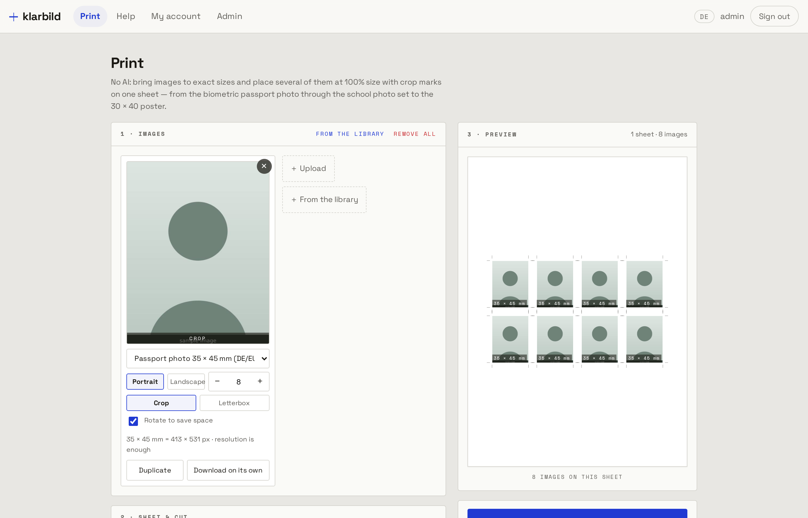
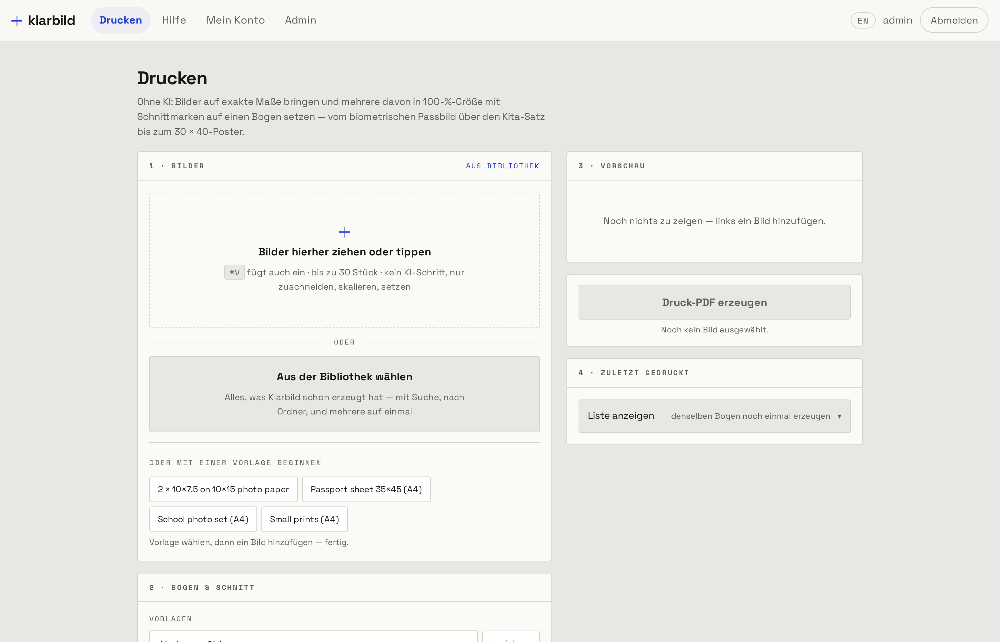
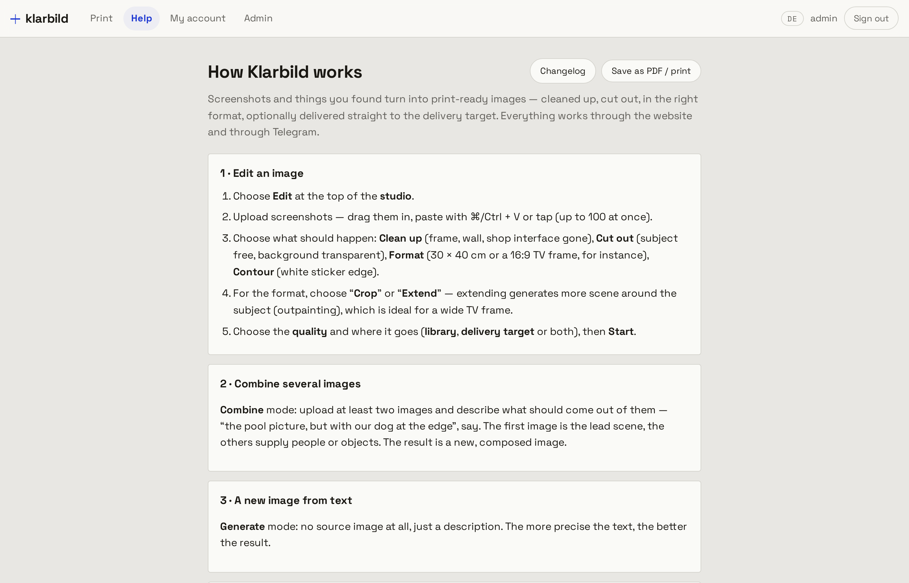

# Klarbild

**Print pictures at the size you actually asked for.**

Your printer driver has a checkbox called "fit to page". Tick it and a 35 × 45 mm
passport photo comes out 34 × 44. Untick it and you are guessing. Photo shops have
software for this; the rest of us have a ruler and a bad afternoon.

Klarbild is that software, self-hosted. Give it an image and a physical size, and
it produces a PDF that measures exactly that on paper — with crop marks, with
bleed if you want it, with as many pictures on one sheet as fit, and with the
oversize cases handled rather than silently scaled.

It also does AI image generation, delivery to a server, share links, mail and a
Telegram bot. **All of that is optional.** The default install is the print studio,
a database, and nothing else — no API key, no model, no object store, no account
anywhere.

**[Lay out a sheet in your browser →](https://klarbild-demo.heidrich-digital.de)** — the demo
page runs this repository's own layout engine client-side and hands you the PDF. No account,
nothing uploaded.

```bash
git clone https://github.com/tillheidrich/klarbild.git && cd klarbild
cp .env.example .env          # four values at the top; the file says which
docker compose up -d
docker compose logs app       # your admin password is printed here, once
```



---

## What the print studio does

**Exact physical sizes.** 86 sizes in 10 groups — passport photo, small prints,
photo formats, US inches, instant-camera, poster and frame sizes, squares, DIN,
cards, plain aspect ratios — or type your own (`25x35`, `13x18`, `10x7,5`). The
output is a PDF laid out in millimetres, not a scaled bitmap, so 30 × 40 cm is
30 × 40 cm.

**Sheet layout.** Put several pictures on one sheet at 100 % with crop marks:
corner marks (0.25 pt, outside the trim) or continuous lines. Equal sizes snap to
an exact grid; mixed sizes go through a MaxRects packer. Bleed 0–10 mm. 19 paper
formats from A6 to A1 — including A3+ and photo paper 9 × 13 to 20 × 30, Letter
and Legal — or a custom sheet.

**Pictures bigger than the sheet, handled three ways.** A 20 × 30 cm print on A4
is not an error message. Choose **fit** (it tells you it will not fit), **overflow**
(centred across the whole sheet, and it quantifies the loss before you print —
"3 mm off each side"), or **tile** (poster print across several sheets, with a
dashed glue flap and a page number on each).

**Crop or letterbox, never distort.** When a picture does not match its target
ratio you decide per picture: crop it (with an interactive zoom-and-pan preview)
or leave a border in a colour you pick. Nothing is ever stretched.

**Captions, duplicates, presets.** A caption in one of six positions, automatic or
your own text — and it disappears by itself when there is no room at that edge.
The same picture can appear twice on one sheet at two different sizes. Presets for
the layouts you repeat; a history of the last 100 runs per account that stores the
*instructions*, never the PDF, so "print that again" costs 1–3 KB instead of 80 MB.

**The browser preview and the server PDF share one engine.** `printlayout.ts` is
pure arithmetic with its own tests. What you see is what gets rendered — the page
of the PDF above measures 210.00 × 297.00 mm, because that is what A4 is.

<p align="center">
  
  
</p>

## What else is in the box, if you switch it on

| Module | What it adds | What it needs |
|---|---|---|
| `print` | everything above | nothing — always on |
| `ai` | clean up screenshots, convert, combine, generate | an OpenRouter key (paid per image) |
| `delivery` | push finished files to an SFTP/FTPS server you already have | that server |
| `mirror` | a second copy of every result, sorted by month | a second target |
| `share` | public links: expiring, revocable, optional passphrase, ZIP download | a public URL |
| `mail` | password reset, job notices, sending share links | your own SMTP mailbox |
| `telegram` | the whole tool from a chat window | a bot token |

```bash
KLARBILD_MODULES=print            # the default
KLARBILD_MODULES=print,ai,share   # pick what you want
KLARBILD_MODULES=all              # everything
```

A module that is off is off: no navigation entry, no settings card, and its API
routes answer 404 rather than 403 — a disabled instance does not advertise what it
could have done.

## Why self-hosted matters here

The pictures are family photos, passport photos, ID pictures and client work.
Klarbild keeps them on your machine. The print studio never makes an outbound
request at all — it is arithmetic, `sharp` and `pdf-lib`. Even with the AI module
on, only what you send to the model leaves the building, and the API key is yours.

Share links are built to be careful rather than convenient: they expire (30 days by
default), they can be revoked, they can carry a passphrase, downloads can be
switched off, and they are `noindex`. Access hangs on the link, not on the image, so
guessing an image id gets you a 404. The view counter records *when* and *with what*,
never *who*: the IP is hashed with a server secret **and** the link id, one row per
visitor per hour, deleted after 90 days.

## Stack and shape

Astro 5 (SSR, Node standalone) with React islands · PostgreSQL · `sharp` ·
`pdf-lib` · `pg-boss` · OKLCH design tokens, no Tailwind. Files go to a volume by
default; S3/MinIO is available but not required.

About 13,700 lines across 117 files, 124 tests, 16 forward-only idempotent
migrations that run themselves on boot. English and German interface — 1,067
entries, covering every translatable string in the source. The English sentence is
the translation key, so there is no key file to keep in sync and a missing entry
degrades to readable English rather than to `print.sheet.title`.

## Install

**Docker (recommended).** `docker-compose.yaml` is the print-only stack: the app
and Postgres, files on a volume. `docker-compose.full.yaml` adds MinIO and turns
every module on. Both read their secrets from `.env` and refuse to start rather than
boot with a default password.

**From source.**

```bash
npm install
cp .env.example .env
npm run dev
```

Migrations and first-run setup happen on the first request. There are no built-in
accounts: the first boot creates one administrator from `ADMIN_USERNAME` /
`ADMIN_PASSWORD`, or generates a password and prints it to the log once.

**Behind a reverse proxy**, set `PUBLIC_BASE_URL` to the address the browser sees.
Coolify users: both compose files carry a commented `SERVICE_FQDN_APP_4321` line.

## For agents and scripts

`GET /llms.txt` describes the whole API in a form a model can read. `/api/*` accepts
a `Bearer` token from the admin area. `mcp/` contains an MCP server, so an assistant
can lay out and fetch a print sheet directly — `exact_size` and `print_sheet` are
the two tools worth knowing.

## Contributing

[klarbild-demo.heidrich-digital.de](https://klarbild-demo.heidrich-digital.de) is the product
page.

Issues and pull requests are welcome — see [CONTRIBUTING.md](CONTRIBUTING.md) for
how the code is laid out and what the house style is. Security reports go to the
address in [SECURITY.md](SECURITY.md), not to the issue tracker.

## Licence

[GNU AGPL-3.0](LICENSE). Use it, change it, run it for yourself or for others — if
you run a modified version as a service, the people using it get your changes too.

Klarbild grew out of a private tool for getting family photos onto paper at the
right size. It is maintained by [Till Heidrich](https://github.com/tillheidrich).
